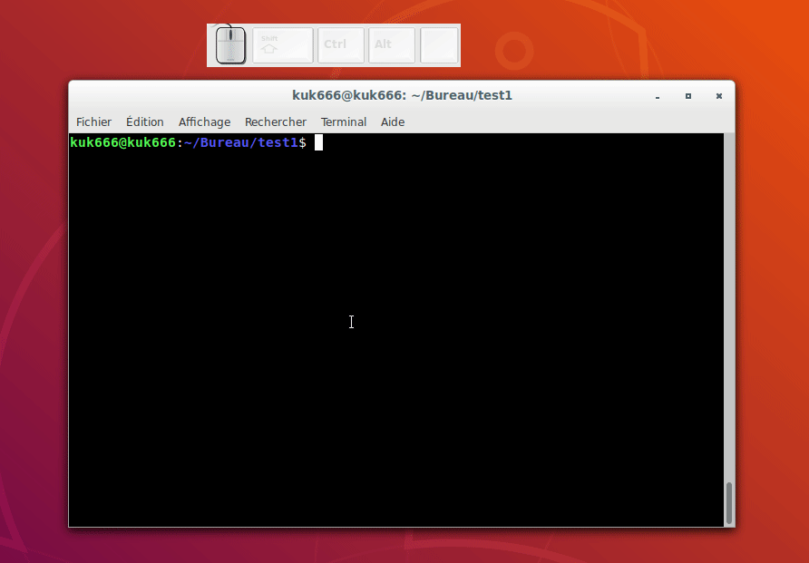

# Cours Linux/bash

  - [I. Histoire de linux.](#i-histoire-de-linux)
  - [II. Le système de fichier de Linux.](#ii-le-syst%C3%A8me-de-fichier-de-linux)
  - [III. La console.](#iii-la-console)
  - [IV. Les commandes.](#iv-les-commandes)
  - [V. RTFM Lire le manuel.](#v-rtfm-lire-le-manuel)
  - [VI. Les droits.](#vi-les-droits)
  - [VII. Installer des programmes.](#vii-installer-des-programmes)
  - [VIII. Rechercher des fichiers.](#viii-rechercher-des-fichiers)
  - [IX. Extraire, trier et filtrer les données.](#ix-extraire-trier-et-filtrer-les-donn%C3%A9es)
  - [X. Les flux de données.](#x-les-flux-de-donn%C3%A9es)
  - [XI. Action sur un serveur distant.](#xi-action-sur-un-serveur-distant)

#### I. Histoire de linux.

**C'est quoi Linux?** 

Linux est un système d'exploitation, au même titre que MacOS et Windows.

En 1984, Microsoft sort son premier OS: MS-DOS. À ce moment, un autre OS existe, c'est UNIX (depuis 1969) Mais il est beaucoup plus compliqué à utiliser, et donc réservé aux pros.

La même année (1984), Richard Stallman, chercheur ou MIT voulait créer son propre système d'exploitation, fonctionant comme Unix. Sa volonté venait du fait que le système Unix devenait de plus en plus chèr. Richard Stallman devint le fer de lance du libre et fonda le projet GNU.
Pour Richard Stallman le progrès passe par la **coopération** et pour cela tout le monde dois avoir accès au code souce de chaque programme. Avoir la liberté de le modifier pour l'améliorer et de pouvoir ensuite redistribuer ce programme à la communauté.
Il commenca donc à développer des **versions libre des programmes Unix**.

**En 1991 Linus Torvalds**, étudiant finlandais, entreprend de créer son propre sytème d'exploitation. Ce système s'appelle Linux, la contraction de Linus et Unix.
En fait Linus lui s'est lancé dans la création du coeur de Linux, le **kernel**. Et les programmes libre du projet GNU ont complété ce coeur pour arriver au résultat **GNU/linux**.

En vérité nous devrions toujours parler de GNU/Linux, car c'est cette assosiation qui donne ce que nous appelons Linux.

Aujourd'hui, il y a un certain nombre de distributions de linux:
[Lien wiki liste distributions Linux](https://fr.wikipedia.org/wiki/Liste_des_distributions_Linux).
À savoir: Toute les distro. partagent le même coeur, changent l'installation, les programmes pré-installés et le manager de programme.
Les deux familles principales sont RedHat (serveurs) et Debian (Ex: Ubuntu).

Voici un lien sur les "parts de marché" de Linux (difficile de mesurer les parts de marché de quelque chose de gratuit):
[Part de marché Linux](https://fr.wikipedia.org/wiki/Linux#Parts_de_march%C3%A9).

#### II. Le système de fichier de Linux.

Sous Unix, le système de fichier est d'une conception assez différente que celle de Windows. Sous Unix tout est considéré comme un fichier, même un lecteur CD ou une clé USB. Comme tout est un fichier il est possible d'avoir des fichiers sans extension. Les disques (comme le `C:` le `D:`, le `E:` etc..)sont juste des fichier spéciaux qui sont montés sur le système de fichiers.

Donc il n'y a pas de `C:`, sur Linux tout commence à la racine notée `/`.
Il y a ensuite un certain nombre de dossiers, voici ceux qui nous intéressent: 

Répertoire | Rôle remplis
-|-
`home/`| Contient les répertoires personnels des utilisateurs.
`var/`| Contient les données variables (logs par exemple).
`bin/`| Contient les programmes communs à tout les utilisateurs.
`usr/`| Contient les programmes des utilisateurs.
`etc/`| Contient les fichiers de configuration.
`opt/` | Contient les _add-ons_ des programmes.
`lib/` | Contient toutes les librairies des programmes.

#### III. La console.

**La console linux (le Terminal)**

La console est un moyen de contrôler un ordinateur. Une interface graphique est un autre moyen, mais même si il est plus intutif, il est aussi plus limité car certaines actions ne sont pas possibles (ex. l'utilisation de `npm`, de `git` ou tout autre programme s'utilisant avec une CLI _"Command Line Interface"_). Plus généralement il est plus long et complexe de développer une interface graphique qu'une commande CLI, étant donné qu'il faut déjà que la commande soit développée avant de lui associer une interface graphique...

L'utilisation est simple, l'invite de commande attend la commande entrée par l'utilisateur.
On peut décomposer l'invite de commande de cette façon :

Login/Pseudo | Chez | nom de l'ordinateur | séparateur | dossier actuel | niveau d'autorisation
-|-|-|-|-|-
kuk666 | @ | kuk666 | : | ~ | $ 

À chaque fois que je commence un morceau de code j'utilise `$` pour indiquer la fin de mon invite de commande. Cela donne ` $ commande `

Une fois la commande exécutée, la console retourne soit une erreur (ici la commande `$ tre` n'existe pas), soit le resultat de la commande (ici `$ ls` retour la liste des fichiers du repertoire courant).

Ces deux sorties s'affichent par défaut dans la console, mais nous verront plus loin qu'il est possible de très facilement changer ce comportement.

#### IV. Les commandes.

Les commandes peuvent être considérées comme des fonctions. Elles peuvent être appelées avec ou sans paramètre(s). 

On voit ici que la commande `ls` (`ls` pour _list_), utilisée seule, liste le contenu du dossier courant. On peut aussi lui donner en paramètre le chemin du dossier à lister. Enfin on peut donner des **options** à la commande (les options commencent toujours par `-` ou par `--`). 

**Les options :**

Les options sont _soit_ une option courte, qui s'écrit avec un seul tiret `-` (par exemple `-a`, `-v`, `-l` etc.), _soit_ une option longue qui s'écrit avec deux tiret `--` (par exemple `--version`).
Les options courtes peuvent être combinées ensemble (par exemple `-la` est la combinaison de `-a` et `-l`).

**Liste des commandes de base :**

Commande | Nom | Description 
-|-|-
`$ ls`| _list_ | Renvoie la liste du contenu du dossier courant.
`$ cd chemin/dossier1/` | _change directory_ | Va au dossier `chemin/dossier1/`.
`$ mkdir nomDossier/` | _make directory_ | Crée le dossier `nomDossier/` dans le répertoire courant.
`$ rm fichier` | _remove_ | Supprime `fichier`. Si la cible est un dossier il faut rajouter l'option `-r` pour _recursive_.
`$ touch nomFichier` | _touche_ | Touche un fichier pour simuler une ouverture. Si le fichier n'existe pas, il est créé.
`$ mv Source Destination` | _move_ | Déplace le fichier Source à la Destination, si le fichier Destination porte un autre nom, le nom du fichier sera modifié.
`$ cp Source Destination` | _copy_ | Copie le fichier Source à la Destination. (option `-R` pour copier un répertoire).
`$ pwd` | _print working directory_ | Affiche le chemin du répertoire courant.
`$ ln ` | _link_ | Permet de créer des liens physique ou symboliques.

Un certain nombre ont de nombreuses et utiles options, voici les plus importantes :

**Pour `ls`:**

Option | Description
-|-
`-a` | --all liste tout les fichiers, même cachés.
`-l` | affiche une liste détaillée.
`-h` | taille en Ko, Go etc... plutôt qu'octets (Human readable).
`-t` | trier par date de dernière modification.

Et 60 autres options. Par la suite nous verrons comment lire le manuel des commandes.

**Pour `rm` :**

Option | Description
-|-
`-i` | Demander confirmation.
`-f` | Forcer la suppression.
`-v` | _--verbose_ Affiche les actions exécutées par la commande.
`-r`| _--recursive_ supprime le dossier et son contenu

Linux protège les données et bloque l'accès aux données sensibles, mais comme toujours sur linux il suffit de passer en super-utilisateur (root).

#### Exemple : 

**`$ cd` :**

**`$ ls` :**

**`$ mv` :**

le fonctionnement serait similaire avec `cp`.

Pour finir ces quelque exemples, voici comment utiliser le Joker `*`:

**Liste des commandes d'affichage :**

Commande | Description 
-|-
`$ cat` | Concatène le(s) fichiers et les affiche d'un coup.
`$ less` | Affiche page par page. Voici quelques raccourci : <kbd>q</kbd> quitte la lecture, <kbd>Espace</kbd> affiche la page suivante, <kbd>/</kbd> permet de faire une recherche (taper <kbd>n</kbd> pour naviguer au résultat suivant).
`$ head` | Affiche le début du fichier (l'option `-n` permet de choisir le nb de lignes à afficher).
`$ tail` | Affiche la fin du fichier (l'option `-n` fonctionne pareil, il s'ajoute `-f` pour _follow_ qui permet de suivre le fichier). Faire <kbd>Ctrl+C</kbd> pour arrêter la commande.

#### V. RTFM Lire le manuel.

Il y a beaucoup, beaucoup de commandes. Sur Ubuntu il y a plus de 2000 commandes installées de base, et s'il y en existe beaucoup plus, il est aussi facile d'en créer d'autre.
Il n'est donc pas possible de les connaitre toutes, et encore plus illusoire de connaitre toute les options de chacune de ses commandes. Il est donc indispensable de savoir lire documentation de bash. 

Si vous poser la question _"comment afficher un fichier avec `less`?"_ sur un forum, on vous dira sûrement: **RTFM**. Autrement dit **Read The Fucking Manual**. Autrement dit, lit le manuel avant de poser ta question (galopin) !!!

Comment faire pour lire la doc d'une commande? Rien de plus simple, il suffit de précéder la commande de la commande `man`. Cela donne quelque chose de cette forme: `$ man ls`.

Et voici le résultat:

La ligne qui nous intéresse ici est le **SYNOPSIS**. Il peut être très simple, comme celui de la commande `ls`:

Ou très complexe comme le `man` de la commande `apt`:

Regardons celà d'un peu plus près, avec le synopsis de la commande `ls`.

**`ls`** `[OPTION]...` `[FILE]...`

1.**`ls`** : Le nom de la commande. Le mot est en **gras** ce qui veut dire qu'il doit être écrit exactement comme indiqué.

2.__`[OPTION]...`__ : Là il y a plusieurs choses. Les crochets `[]` qui signifient _facultatif_, ce qui veut dire que l'on _peut_ ne pas renseigner d'option. 
Le soulignage (si si il est sur la capture d'écran.) nous informe que le mot OPTION est à remplacer. Donc il faudra par exemple écrire `-a` à la place de `OPTION`. 
Enfin les **`...`** indique que le paramètre qui précède peut être répété **autant** de fois que vous voulez.

3.__`[FILE]...`__ : même chose que pour option sauf que cette fois c'est le chemin d'un fichier qui est attendu plutôt qu'une option.

En Français, **`ls`** `[OPTION]...` `[FILE]...`, signifie _Taper la commande `ls` suivie d'un nombre d'options voulues, puis des chemins voulus.

Dans le deuxième exemple on peut voir aussi la pipe `|` qui dans le man représente le **OU Exclusif** logique. Par exemple `{-v | --version}`, je dois soit utiliser `-v`, soit utiliser `--version`, mais pas les deux en même temps.

Syntaxe | Signification
- | -
**`gras`** | Écrire le mot tel quel.
`mot souligné` | Doit être remplacé par la valeur qui convient.
`[]` | Ce qui est entre crochet est facultatif.
a`| `b | OU EXCLUSIF, ici c'est soit a, soit b.
x`...` | Indique que x peut être répété autant de fois que vous voulez.

#### VI. Les droits.

Linux est un système multi-utilisateurs, ce qui veut dire que plusieurs personnes peuvent travailler simultanément sur le même système. 

Pour la stabilité d'une telle organisation il est obligatoire d'avoir des droits bien définis pour chaque utilisateur. De base sur un système Unix il y a 2 utilisateurs. Vous (moi c'est `kuk666`) et le Super-Utilisateur (`root`). On peut ensuite ajouter autant d'utilisateurs que l'on veut, et les rassembler en groupe.
Sous Unix chaque fichier possède un propriétaire. Il y a trois droits possibles sur un fichier, le droit de lecture (`r`), d'écriture (`w`) et d'execution (`x`).
Pour chaque fichier est définit les droits son propriétaire, les droits du groupe et les droits des autres utilisateurs (ces droits des fichiers existent sous Windows aussi.)

Pour connaitre les droits et l'appartenance d'un fichier il existe un commande... `ls`! Plus précisément `ls -l`. Par exemple:

Les quatre premières colonnes en partant de gauche sont les droits. La forme est toujours la même. Soit il y a un tiret `-`, soit un caractère.
La première colonne donne une infomation sur le type. Soit c'est un dossier `d`, soit c'est un lien `l`. Le tiret `-` signifie que c'est _juste_ un fichier.

Ensuite chaque colonne donne les trois droits de l'utilisateur (colonne 2), du groupe, et du reste du monde (4ème colonne)

colonne 1 | colonne 2 | colonne 3 | colonne 4
-| - | - | -
`d` | `rwx` | `rwx` | `rwx`
Type | Utilisateur | Groupe | Autres

Soit le droit est activé, et dans ce cas c'est le caractère du droit en question, sinon si c'est un tiret, le droit n'existe pas. On parle ici d'un triplet de droits.

Ensuite sur les colonnes 5 et 6 on trouve respectivement le propriétaire du fichier, puis le groupe propriétaire.

Analysons le fichier 1, nous avons:

1 | 2 | 3 | 4 | 5 | 6
-|-|-|-|-|-
`-`| `rwx` | `rwx` | `---` | `root` | `root`
tiret donc c'est un fichier | tous les droits sont activés pour le propriétaire | tous les droits sont activés pour le groupe | aucun droits pour les _autres_ | Le propriétaire est `root` | le groupe propriétaire est `root`

On voit que `dossier1` a un droit d'exécution pour tout le monde. En fait pour linux un dossier est un fichier particulier. Et pour pouvoir ouvrir un dossier et naviguer dans ses sous-dossiers il faut pouvoir executer ce _fichier_.

**Changer les droits d'un fichier ?**

Le seul qui peut modifier les droits est `root` ! Pour pouvoir exécuter une commande en root il faut précéder la commande de la commande `sudo`. (`sudo` veut dire **S**ubstitute **U**ser **DO** _" faire en se substituant à l'utilisateur"_). On vous demandera de taper votre mot de passe pour valider l'exécution de la commande (pas de panique si vous ne voyez pas d'étoiles quand vous tapez votre mot de passe, linux _cache_ le nombre de caractères que vous tapez).

**Attention :** En tant que super utilisateur vous avez **TOUS** les droits. Vous devez donc être sûrs de ce que vous faite à ce moment là car personne ne pourra vous empêcher de faire des grosses bêtises !!!

_Exemple:_

Pour modifier les droits d'un fichier il faut utiliser la commande **`chmod`**, soit de manière absolue, soit de manière relative.

**Chmod absolu :**

On peut attribuer des droits avec des chiffres, chaque droit correspond à un chiffre, et pour savoir quels droits on attribue à un triplet, on fait une addition.

Correspondance droit/chiffre:

Droit | Chiffre
-|-
`r` | 4
`w` | 2
`x` | 1

Total des droits:

Droits | Chiffre | Calcul
-| - |-
`---` | 0 | 0 + 0 + 0
`r--` | 4 | 4 + 0 + 0
`-w-` | 2 | 0 + 2 + 0
`--x` | 1 | 0 + 0 + 1
`rw-` | 6 | 4 + 2 + 0
`-wx` | 3 | 0 + 2 + 1
`r-x` | 5 | 4 + 0 + 1
`rwx` | 7 | 4 + 2 + 1

Cela peut paraître un peu complexe au premier abord, mais dès que l'on a un peu l'habitude c'est très rapide car il suffit de faire `$ sudo chmod 700 fichier1` pour donner tous les droits au propriétaire de `fichier1`, mais aucun droit au groupe et aux autres utilisateurs.

**Chmod relatif :**

Un autre moyen de modifier des droits est d'utiliser des lettres.

Lettre ou opérateur | signification
-|-
`u` | user (le propriétaire)
`g` | group (groupe)
`o` | other (tout les autres)
`+` | ajouter un droit
`-` | supprimer le droit
`=` | affecter le(s) droit(s)

On peut facilement changer des droits de cette façon. `chmod g+w fichier1` donne le droit d'écriture au groupe. `chmod u+rx fichier1` donne les droits de lecture et d'execution au propriétaire. `chmod u=rwx, g=r, o=- fichier1 ` donne tous les droits aux propriétaire, le droit de lecture au groupe et rien aux autres.

Pour finir si l'on veut changer les droits d'un dossier et que cela soit répercuté sur chacun des fichiers et sous-dossiers contenus, il faut utiliser l'option `-R` (**R**ecursive) !

#### VII. Installer des programmes.

Installer un programme sur linux est vraiment simple. La plupart des programmes linux son rassemblés sur des serveurs que l'on appelle dépôts. Ils partagent tous le même contenu. Le serveur par défaut est le plus proche géographiquement.

En fait sous linux un programme peut rarement fonctionner seul, il a besoin de bibliothèques. Heureuseument le système de paquets Debian est intelligent, il ira checher seul toute les dépendances manquantes. Ce qui n'est pas le cas sur toutes les distros.

Comment installer un programme sur linux? Avec la commande `apt`. Comme vu dans l'exemple plus haut, le synopsis de la commande `apt` est assez complexe, la commande permet beaucoup de choses. Mais voici les deux formes les plus utiles:

* `apt-cache search votrerecherche` permet d'effectuer une recherche dans le dépot. Le retour de la commande est la liste de tous les programmes qui contiennent le mot clé `votrerecherche`.
* `apt-get install paquet` permet d'installer le paquet.

**exemple :**

Dans cet exemple je commence par chercher un jeu de casse brique (breakout). Ensuite j'installe le paquet `lbreakout2`. Cela me demande mon mot de passe car pour installer un programme je dois être en _Root_ (Super Utilisateur). 
On me donne des informations sur le contenu du paquet et les dépendances dont il a besoin pour fonctionner, et on nous demande si nous voulons continuer. 

Si on répond oui, la magie d'`apt-get` opère: Le programme va aller télécharger tout seul le paquet sur le dépot ainsi que toute les dépendances dont il a besoin et que nous n'avons pas. Puis il _dépaquète_ les fichiers qui étaient à l'intérieur du paquet, les installe et effectue les paramétrages tout seul.

Enfin voici une dernière commande, pour désinstaller un paquet: `apt-get autoremove paquet`. Notez ici `autoremove` permet aussi de désintaller les librairies inutiles.

#### VIII. Rechercher des fichiers.

Pour rechercher des fichier il y a deux commandes, `locate` et `find`. La première est très simple et la deuxième peut devenir très (très très très) complexe.

**`locate` :**

Linux contient une base de données qui est un index de tous les fichiers du disque dur. La base de données se met à jour 1 fois par jour. 
`locate` permet de chercher dans cette base de données, et permet de retrouver un fichier **très rapidement**. Son inconvénient est que si le fichier vient juste d'être créé, il n'apparaîtra pas dans les résultats de recherche car il n'est pas encore inscrit dans la base de données. On peut forcer la mise à jour de la BDD grâce à la commande `sudo updatedb`, mais cette dernière prend un certain temps, donc autant utiliser directement `find`. 

**`find` :**

`find` elle ne fait pas un recherche dans la base de données, mais parcours le systeme de fichier depuis l'endroit spécifié, ce qui peut être long. (Si vous avez 500Go et que vous lancez une recherche à la racine `/`, vous pouvez aller boire un café tranquille !!).

Le fonctionnement de `find` est le suivant:
**`find`** _`Où`_ _`Quoi`_ _`Que faire avec`_

Seul le _`Quoi`_ est obligatoire. Si le _`Où`_ n'est pas spécifié, `find` se lance dans le fichier courant, et si _`Que faire avec`_ n'est pas spécifié non plus, la commande se contente d'afficher le résultat de la recherche dans la sortie standard (la console).

Développons maintenant chacun de ces trois paramètres.

**Où :**

C'est sans aucun doute le plus simple à utiliser, puisqu'il suffit d'indiquer le nom du repertoire dans lequel va s'effectuer la recherche. Gardez tout de même à l'esprit que plus la commande va avoir de chemins à parcourir plus elle sera longue à s'éxécuter.

**Quoi :**

Là on a envie de dire que c'est simple et qu'il suffit de mettre le nom du fichier que l'on cherche, mais ca serait passer à côté d'une grande partie de la puissance de `find`.

En fait on peut chercher un fichier par d'autre moyen que son nom. Voici une partie des possibilité du `Quoi`:

Test | Signification
-|-
`-name` _`motif`_ | Rechercher les fichiers qui corespondent exactement au motif fourni. Attention,  pensez à entourer le motif du joker (_`*motif*`_) si vous voulez inclure les résutat qui ne sont pas exactement _`motif`_.
`-size` _`n`_`[cwbkMG]` | rechercher par taille de fichier. _`n`_ est à remplacer par un nombre. Il est préfixé de `+` ou `-` et suffixé d'une des lettres entre crochet (M = Mo, G = Go). 
`-atime` _`n`_ | dernier accès au fichier il y a _`n`_*24 heures.
`-perm` _`mode`_ | Fichier dont les autorisations d'accès sont fixées exactement au mode indiqué (en notation symbolique ou octale). 
`-user` _`utilisateur`_ | fichier appartenant à l'_`utilisateur`_ indiqué.

C'est une liste non-exaustive, pour connaitre toute les posibilité pour le `Quoi` lisez le man. Ce ne sont pas des options exclusives, ce qui veut dire que vous pouvez combiner ces test ensemble. Par exemple si je cherche un fichier `.jpg` auquel je suis sûr d'avoir eu accès il y a 3 jours, et je sais qu'il fait moins de 2Mo et qu'il m'appartient, cela donne: `$ find ~ -name "*.jpg" -size -2M -atime 3 -user moi`

**Que faire avec :**

Allez, ça c'était la partie facile de la commande `find`, maintenant voici ce qui fait que la commande `find` est si puissante.

Que faire avec? Nous avons dit plus haut que par défault, la commande `find` affiche le résultat dans la console. En fait, `find` est executé avec l'option `-print`. 

Il y a plusieurs options qui permettent de formatter la sortie, et de l'envoyer dans un fichier plutôt que dans la console. Il faut absolument connaître `printf`_`format`_ qui permet de choisir de manière très précise quelles informations du fichier afficher (parmi les meta-données) et permet aussi d'ajouter du texte personalisé.

Au delà des notions de format, l'option qui fait toute la puissance de find est `-exec`_`commande`_. Cela permet d'utiliser une commande pour chacun des résultats ! Et vous pouvez exécuter presque toute les commandes. La syntaxe est composé de quatre élements:

Élement | signification
-|-
`-exec` | exécuter
`commande`| la commande que l'on veut exécuter
`{}`| Les accolades prendrons pour valeur chacun des résultats que `find` va trouver.
`\;`| Est pour indiquer que l'on est arrivé à la fin de la commande

Comment faire si je veux copier toute les images .jpg de mon disque dur dans un autre dossier ?

**exemple :**

 

Ici j'ai volontairement bridé la commande avec l'option `-maxdepth 1` pour que find ne descende pas plus en profondeur dans l'arborescence que 1 étage, soit le dossier courant, ceci pour ne pas faire un gif ou rien ne se passe, le temps que la commande s'exécute...

#### IX. Extraire, trier et filtrer les données.

Nous allons maintenant voir quelques commandes qui permettent d'extraire, de trier et de filtrer les données. Aucune de ces commandes ne modifie le fichier de base.

* `wc` : est l'abréviation de Word Count, cette commande permet de compter le nombre de mots dans un fichier, le nombre de lignes et le nombre d'octets. Avec les options on peut plus précisément choisir quels informations afficher (et il y en a plus que les trois décrite ici).
* `uniq` : nous permet de d'afficher le contenu d'un fichier sans les lignes en doublons. En fait elle nous permet aussi de voir le nombre d'ocurence de chaque ligne (`-c`), ou n'afficher que les lignes présente en double (`-d`).
* `sort`: nous permet de trier un fichier (par ordre lexicographique). On peut inverser le tri (`-r`), trier aléatoirement (`-R`) et beaucoup d'autres tris (mois, jour de la semaine etc...).
* `cut` : nous permet de couper une partie d'un fichier. On peux couper selon un nombre de caractères, ou selon un délimiteur. Dans ce dernier cas il faut utiliser `-d delimiteur` pour définir quel symbole dans la ligne sert de delimiteur (pour un espace ne pas oublier les apostrophes). Ensuite il faut préciser quel champ nous voulons afficher avec `-f numéros` (on peut entrer les numéros de plusieurs champs).
* `grep`: filter les données. Cette commande est sans doute la plus utilisée de toutes et mérite donc de se pencher un peu dessus.

**`grep` :**

L'idée de cette commande est simple, elle permet de rechercher un mot ou une expression régulière dans un fichier. 

**Par exemple :** 
`$ grep class index.html` me renverra toutes les lignes ou sera présent le mot _"class"_. Petite précision, le mot cherché peut être précédé et suivi par d'autres caractères sans que cela n'affecte la recherche. `class` sera trouvé dans _**class**ique_, _hyper**class**e_ . Par contre la casse est prise en compte par defaut, pour ne pas en tenir compte il faut utiliser l'option `-i`.

Cette commande a quelque options très utiles: 
 * `-n` : affiche le numéro de la ligne ou est trouvé le mot.
 * `-v`: inverser la recherche, c'est à dire ignorer le mot. Cela affichera toute les lignes ou on ne trouve pas le mot.
 * `-r` : Rechercher dans tout les fichier et les sous-dossiers, cette fois il faudra indiquer le nom du répertoire de recherche au lieu du nom de fichier.

Nous pouvons aussi utiliser les expressions régulières pour faire des recherches très poussées. Pour pouvoir les utiliser, il faut ajouter l'option `-E`

Et puis c'est tout. Cette commande est assez simple mais très puissante. Avec le chapitre suivant nous allons voir que l'on peut l'utiliser d'une autre façon qui nous sera très utile.

#### X. Les flux de données.

Nous avons vu plusieurs fois la notion de sortie standard, mais aussi la sortie d'erreur. Ici nous allons voir comment maîtriser les flux de donnée. 

Prenons pour exemple la commande `ls`. Nous nous rappelons qu'elle sert à lister les fichiers contenus dans le dossier donné en argument. Si aucun dossier n'est précisé, c'est par defaut le répertoire courant qui sera listé.

Nous avons deux possibilités, soit le chemin du dossier est valide et `ls` nous affiche la sortie standard (le résultat). Dans le cas où le dossier n'est pas valide, il y a une deuxième sortie possible, la sortie d'erreur.

Nous avons donc, pour chaque commande **deux** sorties possibles et **distinctes :** La sortie standard et la sortie d'erreur. Par défaut ces deux sorties s'affichent dans la console, c'est pour cette raison que nous ne faisons pas forcement attention à cette distinction, mais cela sera utile pour la suite.

Si c'est un comportement par défaut cela veut dire que l'on peut faire autrement!

**Rediriger le résultat dans un fichier :**

Imaginons que nous souhaitions conserver la liste de tous les films qui sont dans notre dossier Vidéo, pour par exemple la partager. Comment feriez vous en graphique ???
En console en tout cas c'est très simple: il suffit d'ajouter en fin de commande le chevron fermant `>` suivi du nom du fichier dans lequel écrire la sortie standard. Si le fichier n'existe pas, il est créé. 

Cela donnerait quelque chose comme ça: 
`$ ls /home/kuk666/Video/ > sortie.txt`

Attention, le "problème" du chevron simple c'est que si le fichier cible existe déjà, il est écrasé. Pour simplement ajouter du contenu à celui déjà existant, il nous faudra utiliser les doubles chevrons fermants `>>`.

Petite précision ici, nous parlons bien de rediriger la sortie standard de la commande. Avec cette manière de faire, les erreurs s'afficheront quand même dans la console.

**Le trou noir de Linux :**

Vous pourriez avoir envie de ne voir la sortie standard ni dans un fichier ni dans la console. Dans ce cas vous pouvez la rediriger dans le trou noir de linux, le repertoire `/dev/null`. Pourquoi le trou noir? Tout simplement que tout ce qui entre dans ce répertoire disparait irrémédiablement... 

**Rediriger les erreurs :**

Le même mecanisme est utilisé pour la redirection des erreurs, mais avec `2>` et `2>>`, pour les redigirer dans un fichier ou à la fin d'un autre fichier.

Si l'on reprend l'exemple précèdent avec en plus une redirection des erreurs à la fin d'un fichier log.txt (par exemple), ça nous donne:
`$ ls /home/kuk666/Video/ > sortie.txt 2>> log.txt`

**Fusions des sorties :**

Parfois on peut avoir besoin de fusionner les sorties, c'est à dire rediriger les deux sorties au même endroit (c'est d'ailleurs le comportement par défaut, les deux sorties s'affichent dans la console).

Pour faire cela il y a deux étapes. Il faut commencer par rediriger la sortie standard. Ensuite en fin de commande nous ajoutons `2>&1`. 
La petite subtilité ici c'est que `2>&1` redirige les erreurs de la même façon que la sortie standard. Cela veut dire que si la sortie standard écrit les donnéees en fin de fichier, `2>&1` fera de même. 

**Chaîner les commandes :**

C'est sans doute le plus grand intérêt de la console. Le fait de pouvoir chainer les commandes, c'est à dire envoyer la sortie standard à... **l'entrée** de la commande suivante. 

Toutes les commandes que nous avons vues jusqu'à maintenant sont très simples.  Cela vient du fait que la plupart de ces commandes date des années 60.... Et si on utilise toujours les mêmes commandes, c'est parce qu'elle font une action très simple mais qu'elles le font bien. La console trouve toute sa puissance dans sa possibilité de combiner ces petites commandes ensemble pour arriver à un résultat attendu.

**Exemple :** 

Imaginons que nous voulions afficher la liste de toutes les images .jpg que nous avons en vrac dans un dossier avec des .pdf, .txt etc..
Nous connaissons `ls` pour faire la liste des fichiers et `grep` pour filtrer les lignes qui contienne un .jpg !
La commande sera donc : `ls -l | grep .jpg`

Le fait de pouvoir chainer les commandes permet de décluper l'utilité de la console. Nous venons de voir un exemple très simple, mais vous pouvez chainer les commandes à l'infini, donc vous pouvez écrire des commandes très puissante. 

Imaginez que vous ayez 10 fichiers nommés f1, f2, ..., f10, regroupant des centaines d'emails. Vous voulez avoir un seul fichier avec les emails triés par ordre alphabétique sans aucun doublons. En plus vous ne voulez que les adresses gmail. 
Nous savons déjà que nous allons devoir rediriger le résultat dans un fichier (par exemple ici `liste_gmail.txt`). Il va aussi falloir afficher les 10 fichiers, donc `cat`, filtrer les donnée, donc `grep`, puis trier et enlever les doublons.

**Réponse :** `$ cat f* | grep gmail | sort | uniq > liste_email.txt `

#### XI. Action sur un serveur distant.

Souvent nous serons ammenés à faire des transferts de fichier entre des ordinateurs distants. Nous allons parler de deux manières de faire. En se connectant en **ssh** sur l'ordinateur distant, [voir cours](https://openclassrooms.com/fr/courses/43538-reprenez-le-controle-a-laide-de-linux/41773-la-connexion-securisee-a-distance-avec-ssh). Sinon il faut passer par un **serveur FTP** (on a aussi les deploiements avec git, mais qui se basent en réalité sur ssh ou http, et d'autres protocoles disons plus ésotériques).

**ssh :**

Pour savoir comment se connecter en **ssh** je vous laisse suivre le morceau de tuto OpenClassrooms ci-dessus. Par contre une fois connecté il vous faudra connaitre la commande qui permet de copier des fichiers sur le réseau. 

La commande est `scp` pour _Secure CoPy_. Elle s'utilise exactement comme cp, c'est à dire `scp fichier_origine copie_destination`. La différence est que chacun des deux argument peut s'ecrire sous la forme `login@ip:nom_fichier`. Si le seul le nom du fichier est écrit, alors la commande scp considérera que le fichier ce trouve sur l'ordinateur local.

**ftp :**
En passant par une connection à un serveur FTP, les choses sont un peut différentes. 

Déjà il faut commencer par se connecter au serveur FTP. Pour ça il suffit d'entrer la commande `ftp adresse_serveur` (ou d'utiliser une interface graphique bien sûr). 
Une fois connecté vous avez un prompt de la forme `ftp> ` qui attend des commande, toute celles que nous connaissons déjà (`ls`, `cd`, `mv` etc...). Il y a quelques commandes qui ont des noms différents, je vous laisse regarder le `man` de la commande ftp pour en savoir plus.
Nous pouvons avoir besoin de faire toutes ces commandes de notre coté, et non sur le serveur, pour cela il suffit d'ajouter un `!` devant la commande pour qu'elle s'exécute de notre coté.

Pour transférer des fichiers sur le réseau il y a deux commande à connaitre :

* `put`: envoie un fichier vers le serveur.
* `get`: télécharge un fichier depuis le serveur.

> Attention! Le gros problème de la commande ftp,  c'est qu'elle n'est pas sécurisée, c'est à dire que toute les données voyagent en clair sur le réseau. Heureusement, il existe la commande `sftp`  pour _secure_ FTP qui fait les chose de la même façon, et même mieux que `ftp`. Mais il faut utiliser ssh pour se connecter.

* `rsync`: une dernière commande pour finir, `rsync` permet une syncronisation de deux répertoires. Elle est souvent utilisée pour effectuer des sauvegardes incrémentielles.

## FIN.

Tout ce tuturiel est inspiré du cours _Reprendre le controle à l'aide de Linux_ gratuit disponible sur [OpenClassrooms](https://openclassrooms.com/fr/courses/43538-reprenez-le-controle-a-laide-de-linux). N'hésitez pas à aller le voir pour en apprendre plus! 